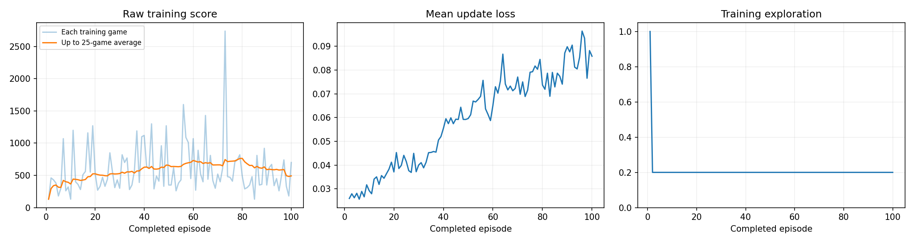
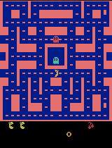
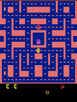

# pacman-dqn
Fundamentals of Agentic AI (Fall 2026) Assignment 2
# Ms. Pac-Man DQN Agent

Fundamentals of Agentic AI (Fall 2026) — Assignment 2

## Overview

This project trains a Deep Q-Network (DQN) agent to play Ms. Pac-Man using the provided course notebook. The goal of the experiment was to choose three training hyperparameters, observe how the agent's behavior changed through trial and error, and compare its performance before and after training.

The final agent was trained for 100 episodes. Its mean evaluation score increased from **492.0 before training to 608.0 after training**, an improvement of **116 points (23.6%)**.

## How to Run

The executed notebook is available here:

[Jenna_Wang's_pacman_dqn.ipynb](Jenna_Wang's_pacman_dqn.ipynb)

To reproduce the experiment:

1. Open the notebook in Google Colab, Jupyter, or VS Code.
2. If using Colab, select a T4 GPU if available.
3. Set the three hyperparameters in Section 1.
4. Run all cells in order.
5. Keep the notebook's evaluation settings unchanged.
6. Compare the five evaluation games before and after training.

The notebook contains the outputs from my final completed run.

## Hyperparameter Choices

| Hyperparameter | Value | Reason |
|---|---:|---|
| Exploration | 0.20 | I wanted the agent to continue exploring alternative actions while still using its learned policy most of the time after warm-up. |
| Episodes | 100 | I chose 100 episodes to provide substantially more learning experience than the initial 5-episode setup check while keeping the experiment manageable. |
| Learning rate | 0.0001 | I chose a relatively small learning rate so the DQN would make gradual updates rather than changing its estimates too aggressively. |

The complete experiment configuration is available in [config.json](config.json).

## Prediction Before Training

Before training, I expected the agent to improve its score over time as it learned which actions were associated with higher future rewards. I expected 20% exploration to help it discover alternative paths while allowing the learned network to control most decisions after the initial random warm-up.

I did not expect 100 episodes to produce expert-level Ms. Pac-Man play, but I expected the trained network to perform better on average than the untrained network.

## Training Run

The final run completed successfully.

| Metric | Result |
| --- | --- |
| Completed episodes | 100 |
| Total decisions | 58,327 |
| Learning updates | 14,332 |
| Training + periodic demo time | 222.1 seconds |
| Hardware | NVIDIA T4 GPU (Google Colab) |
| Exploration after warm-up | 20% |
| Learning rate | 0.0001 |

The detailed records are available in [training_summary.json](training_summary.json) and [training.csv](training.csv).

## Training Dashboard

The training scores were highly variable. Some episodes scored above 1,000 and the best training episode reached 2,740, but performance did not improve steadily throughout the run. The mean update loss generally increased during training, while game scores remained highly variable, showing that training loss alone is not a reliable measure of gameplay performance.

## Before vs. After Evaluation

The untrained and trained networks were evaluated using the same five seeds, 5% evaluation exploration, and the same time limit.

| Evaluation Game | Before Training | After Training |
|---|---:|---:|
| 1 | 350 | 380 |
| 2 | 500 | 380 |
| 3 | 320 | 760 |
| 4 | 800 | 760 |
| 5 | 490 | 760 |
| **Mean** | **492.0** | **608.0** |

The mean score increased by **116 points**, or approximately **23.6%**.

Full evaluation data: [comparison.json](comparison.json)

## Gameplay Evidence

### Before Training

This is the untrained network before any learning:

### Intermediate Training

**After 25 episodes**

**After 50 episodes**

**After 75 episodes**

**After 100 episodes**

### Best Final Evaluation Game

The notebook selects the best gameplay sample from the five final evaluation games:

## What the Agent Learned

The agent showed measurable improvement, but its behavior remained inconsistent. The mean evaluation score increased from 492.0 to 608.0, and three of the five final evaluation games scored 760.

The training history also showed that the agent became capable of occasionally achieving much higher scores. For example, one training episode reached 2,740. However, high-scoring episodes were mixed with much lower-scoring episodes, so the agent did not learn a consistently strong strategy.

Overall, the results suggest that the DQN learned some useful associations between visual game states, actions, and future rewards, but 100 episodes were not enough to produce a stable Ms. Pac-Man policy.

## Observations, Actions, and Rewards

**Observations:** The agent observes a stack of four consecutive grayscale game screens, each resized to 84 × 84 pixels. Using four screens instead of one helps the network infer movement, such as the direction Ms. Pac-Man or the ghosts are traveling.

**Actions:** The agent chooses among the available joystick actions. During training, it sometimes chooses a random action to explore and otherwise selects the action with the highest predicted future reward.

**Rewards:** Rewards come from the game score. The DQN learns through trial and error by associating its observations and actions with the rewards that follow. Training rewards are clipped between -1 and +1 for the learning updates, while the evaluation scores reported above use the original game scores.

## Limitation

One important limitation was the high variance in performance. Although some training episodes achieved scores above 1,000 and one reached 2,740, the 25-game moving average eventually declined again near the end of training.

This suggests that the agent learned some useful behavior but had not converged to a stable policy. The small replay memory, limited training budget, constant exploration rate, and stochastic game environment may all contribute to this variability.

## Next Experiment

For my next experiment, I would change **only the number of training episodes from 100 to 200**, while keeping exploration at 0.20 and the learning rate at 0.0001.

The purpose would be to test whether additional training experience makes the learned behavior more consistent. I would compare the same five evaluation scores again rather than relying only on individual high-scoring training episodes.

## Files

- [Executed notebook](Jenna_Wang's_pacman_dqn.ipynb)
- [Experiment configuration](config.json)
- [Training data](training.csv)
- [Training summary](training_summary.json)
- [Before/after evaluation](comparison.json)
- [Training dashboard](training_dashboard.png)

Large model checkpoints are retained in the full local results archive rather than committed to this repository.
